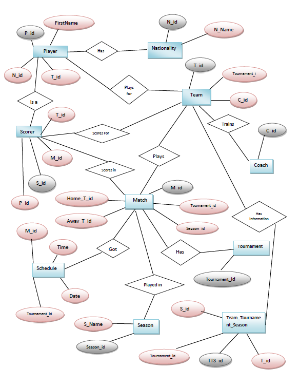
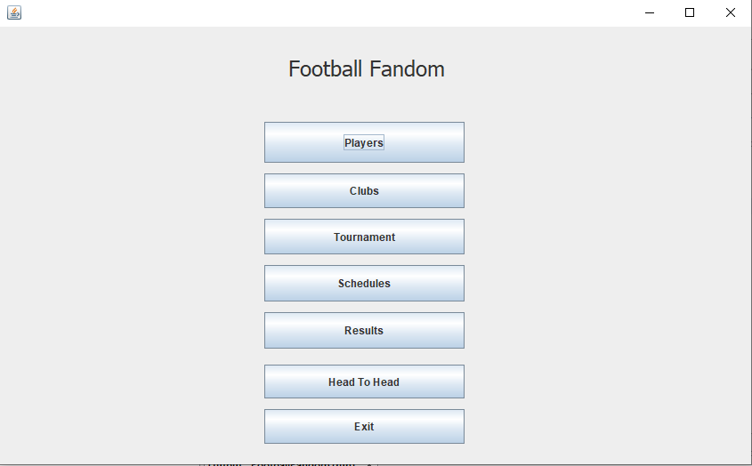
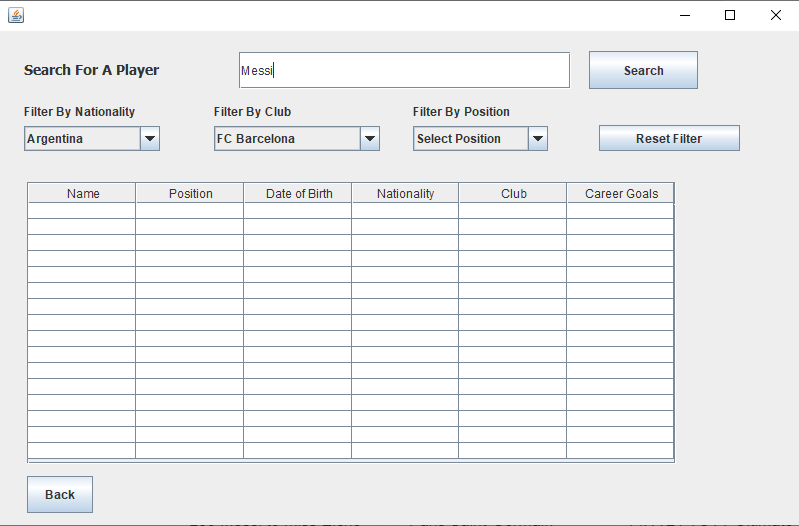
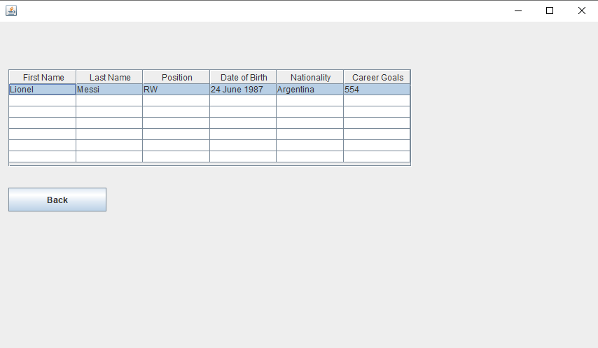

# Football-Fandom

## Table of contents

* [Introduction](#introduction)

* [Features](#features)

* [Technologies](#technologies)

* [ENTITY RELATIONSHIP DIAGRAM](#ERD)

* [Screenshots](#screenshots)

## Introduction

Football Fandom is desktop application especially designed for football fans. With this software people will be able to find useful statistics about any football tournaments, 
teams, players and many more.

## Features

- Can see statistics of favorite teams
- Can see statistics of favorite players
- Can see top scorer in a tournament
- Can see club Information
- Can see fixture
- Can see match result
- Can see Tournament information.
- Can make his own fixture filtering by tournament.
- Can compare teams

## Technologies

OS: Platform Independent 

Programming language: Java

Tools: Microsoft SQL Server 

Database: SQL Server 2005/ 2012

## ERD

  

## Screenshots

  

  

  

